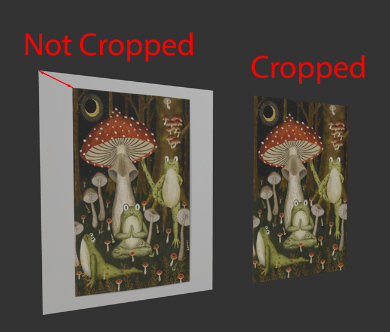
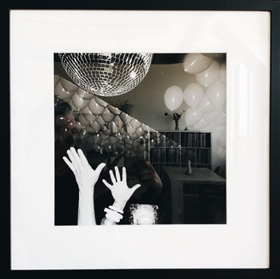
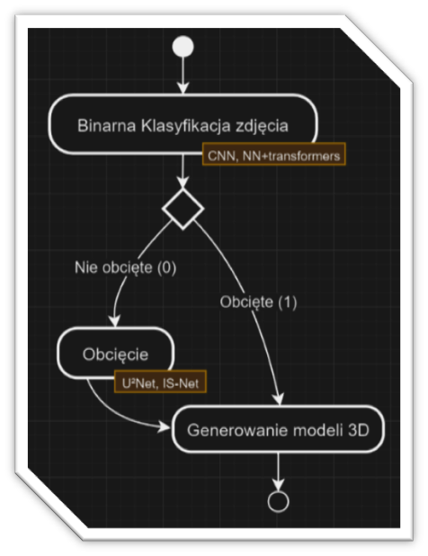
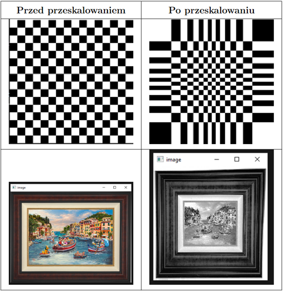
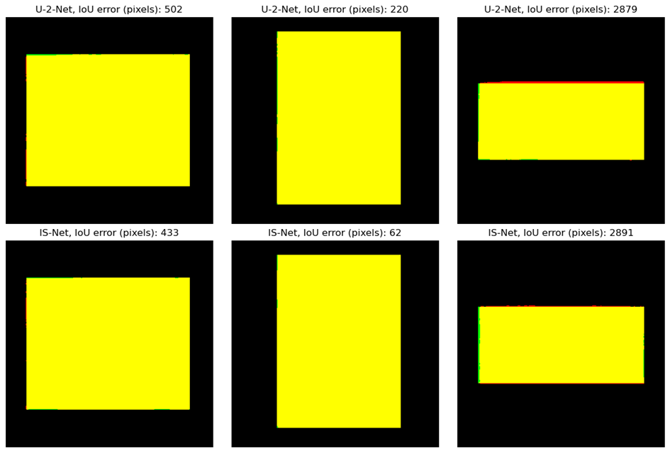

# Automatyzowana generacja płaskich modeli 3D z obrazów

## Opis projektu
Projekt ma na celu automatyzację procesu tworzenia płaskich modeli 3D z obrazów poprzez wykorzystanie technik uczenia maszynowego. System automatycznie wykrywa i wycina obiekty z obrazów, a następnie przekształca je w modele 3D.

Modele są przetrenowane na takich obiektach jak obrazy, postery i różne dzieła sztuki wiszące na różnych ścianach.

## Problem obcięcia

Obcięcie zdjęć byłoby prostym problemem realizowanym za pomocą zwykłych algorytmów CV, gdyby nie różnorodność przyjmowanych zdjęć.
Tło (ściana) może mieć różny kształt kolor i rysunek, co utrudnia problem obcinania
|  |  |
|:------------------------:|:------------------------:|
| Nie obcięte              | Obcięte                  |

## Algorytm
### Pipeline

- Klasyfikacja - Conwolucyjna Sieć Neuronowa 
- Obcięcie - Segmentacja SOD (Silent Object Detection)
- Generowanie płaskiej modeli 3D - Trimesh 

Plik z implementacją algorytmu: [crop_generate.py](./crop_generate.py)

### Inne algorytmy
- Wstępne przetwarzanie obrazów dla CNN: [local_package/ConvNN.py](./local_package/ConvNN.py)
    
- Przygotowanie danych do zegmentacji [Cropping/assets/images_preparation.ipynb](./Cropping/assets/images_preparation.ipynb)
- Obcięcie zdjęć (obcięćie jak niektórych zdjęć z datasetu `trim_to_edges()`, tak i nowych obrazów `crop_new_assets/image()`): [local_package/Cropping.py](./local_package/Cropping.py)
- Ewaluacja modeli obcięcia [Cropping/results_evaluation.ipynb](./Cropping/results_evaluation.ipynb)

